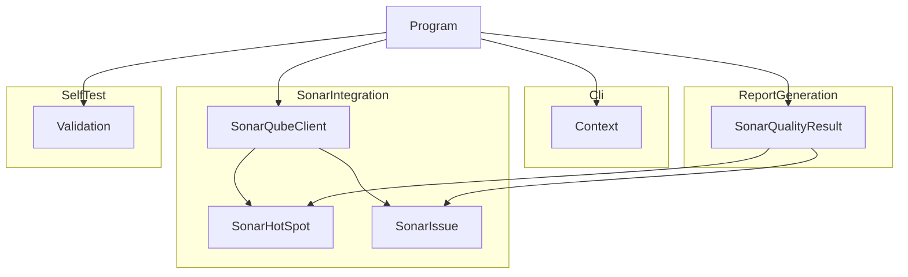

# SonarMark

## Architecture

SonarMark operates as a single-process .NET CLI tool. The four subsystems collaborate in
sequence under the `Program` entry point:

There is no system-level code. `Program` acts as the orchestrator, delegating to the
appropriate subsystem based on the flags present in `Context`.

## External Interfaces

**CLI Interface**: The `sonarmark` command-line executable.

- *Type*: CLI
- *Role*: Provider — the host environment (shell, CI runner) invokes this interface.
- *Contract*: Accepts flags `--server`, `--project-key`, `--branch`, `--token`, `--report`,
  `--depth`, `--report-depth`, `--enforce`, `--validate`, `--results`, `--silent`, `--log`,
  `--version`, and `--help`. Returns exit code 0 on success, 1 on error or quality-gate
  enforcement failure.
- *Constraints*: `--server` and `--project-key` are required when running analysis. `--depth`
  must be an integer in the range 1–6. `--report-depth` is a deprecated alias for `--depth`
  and also accepts the range 1–6.

**SonarQube/SonarCloud REST API**: The HTTP API exposed by the remote server.

- *Type*: HTTP/REST
- *Role*: Consumer — SonarMark calls out to the server.
- *Contract*: Uses five endpoints: `/api/components/show`, `/api/qualitygates/project_status`,
  `/api/metrics/search`, `/api/issues/search`, and `/api/hotspots/search`. Responses are JSON.
  Authentication uses HTTP Basic Authorization with a PAT as the username and an empty password.
- *Constraints*: Non-2xx responses raise `InvalidOperationException`. Pagination is handled
  automatically for issues and hot-spots.

**Markdown Report File**: The optional file written when `--report` is specified.

- *Type*: File
- *Role*: Provider — SonarMark writes this file for downstream tools.
- *Contract*: GitHub-flavoured markdown containing a project header with dashboard link,
  quality gate status, a conditions table, an issues list, and a security hot-spots list.
- *Constraints*: The `--depth` flag controls the top-level heading depth (1–6).

**Validation Results File**: The optional TRX or JUnit XML file written when `--results` is
specified alongside `--validate`.

- *Type*: File
- *Role*: Provider — SonarMark writes this file for CI test result consumers.
- *Contract*: TRX format for `.trx` extension; JUnit XML format for `.xml` extension.
- *Constraints*: Written only when `--validate` is also passed.

## Dependencies

- **DemaConsulting.TestResults**: provides `TestResults`, `TestResult`, `TestOutcome`, and
  `TestResultsIO` types used by the SelfTest subsystem — see *DemaConsulting.TestResults
  Integration Design*

## Risk Control Measures

N/A - not a safety-classified software item.

## Data Flow

When invoked for SonarQube analysis, data moves through the system in the following steps:

1. `Context.Create` parses CLI flags and provides server, project-key, branch, and
   authentication token to the rest of the system.
2. `Program.ProcessSonarAnalysis` validates that `--server` and `--project-key` are present
   before any network activity begins.
3. `SonarQubeClient.GetQualityResultByBranchAsync` issues async HTTP requests to five
   SonarQube/SonarCloud API endpoints and assembles the results into a `SonarQualityResult`.
4. `SonarQualityResult.ToMarkdown` renders the aggregated data as a markdown report string.
5. `File.WriteAllText` writes the rendered markdown to the `--report` path when supplied.
6. `context.ExitCode` returns 0 on success, or 1 if any error was written via
   `context.WriteError`.

## Design Constraints

- Platform: targets net8.0, net9.0, and net10.0; runs natively on Windows, Linux, and macOS
  with no platform-specific code paths.
- Architecture: single-process; no inter-process communication, microservices, or
  shared-memory coordination.
- Output format: plain GitHub-flavoured markdown; no binary output formats.
- Network: all SonarQube/SonarCloud calls are asynchronous (async/await); the orchestration
  layer in `Program` performs a deliberate sync-over-async bridge.
- Self-test: validation runs inside the same process and binary as the analysis path,
  guarded by the `--validate` flag.
